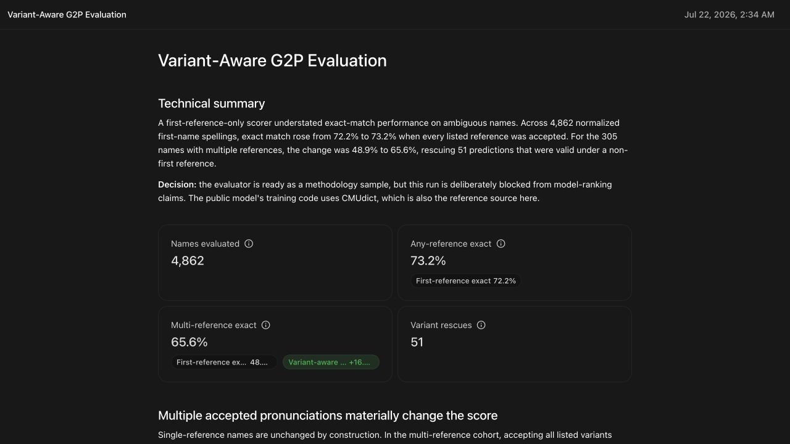

# Variant-Aware G2P Evaluation

A reproducible evaluation harness for grapheme-to-phoneme (G2P) systems that
scores every valid pronunciation reference, preserves row-level error evidence,
and blocks model-ranking claims when the evaluation references overlap model
training data.



## Why variant-aware scoring matters

Pronunciation dictionaries often contain more than one valid pronunciation for
the same written name. An evaluator that compares a prediction only with the
first listed reference can mark a valid pronunciation as wrong.

In the included public-data demonstration:

| Metric | Result |
| --- | ---: |
| Evaluated names | 4,862 |
| First-reference exact match | 72.19% |
| Any-reference exact match | 73.24% |
| Valid predictions rescued by another reference | 51 |
| Multi-reference first-reference exact match | 48.85% |
| Multi-reference any-reference exact match | 65.57% |

The important result is methodological: 51 predictions exactly match a listed
non-first pronunciation that first-reference-only scoring would reject.

## What the harness does

- evaluates exact match against both the first reference and every reference;
- minimizes raw phoneme edit distance and phoneme error rate (PER)
  independently;
- retains the minimum-PER reference (with raw distance and source order as
  tie-breakers) and row-level failure evidence;
- reports single-reference and multi-reference cohorts separately;
- downloads pinned public sources and verifies their SHA-256 digests; and
- emits a blocking quality check when training/reference independence is not
  established.

## Data eligibility

The run lowercases source entries and includes only spellings matching
`[a-z]+`. In the pinned source snapshot, 40 unique spellings fail that filter:
all 40 are ASCII entries containing spaces, punctuation, or trailing
whitespace; none is non-ASCII. This is a bounded demo filter, not a claim about
which names or spellings are valid.

## Critical limitation

The included run is labeled `DEMO_ONLY_TRAINING_OVERLAP`. The `g2p-en` training
source loads CMUdict, and CMUdict is also the gold-reference source in this
demonstration. These numbers exercise the evaluator; they do **not** establish
held-out model quality and must not be used to rank or select a model.

## Reproduce

Python 3.11 or newer is recommended.

```bash
python3 -m venv .venv
.venv/bin/pip install -r requirements.txt
.venv/bin/python run_evaluation.py \
  --generated-at 2026-07-22T09:34:39Z \
  --output-dir artifacts
.venv/bin/python -m unittest discover -s tests -v
```

The evaluator downloads three NLTK data archives pinned to commit
`550b6625bcef1f2abff2ff770a5a0d272c9c6b2a`, verifies their SHA-256 digests,
and writes:

- `artifacts/evaluation_rows.jsonl` — full row-level evidence;
- `artifacts/evaluation_summary.json` — metrics and data-quality checks;
- `artifacts/evaluation.sqlite` — auditable report tables and SQL sources; and
- `artifacts/artifact.json` — canonical portable-report payload.

The repository also includes two prebuilt review surfaces generated from that
payload: `artifacts/report.html`, a self-contained static report with no
embedded reader runtime or external requests, and `artifacts/report-preview.jpg`,
a 1280x720 preview. The evaluator does not rebuild those two presentation
files.

Run the focused test suite without rebuilding the data:

```bash
python3 -m unittest discover -s tests -v
```

## Proper held-out follow-up

A decision-grade evaluation should replace the public sources with a frozen,
consented held-out set and a versioned training manifest. It should add locale,
language, top-k candidates, confidence, and human-review outcomes, with the
primary metric and slices declared before model outputs are examined.

## Data notices and license

Derived names and phoneme references remain subject to the source-corpus terms
in [`THIRD_PARTY_NOTICES.md`](THIRD_PARTY_NOTICES.md). Keep that file with any
copy of the derived artifacts.

The original source code in this repository is available under the MIT License.
That license does not replace the third-party terms governing downloaded data or
derived corpus outputs, and it does not relicense separately installed software
dependencies. The dependency notices include the GPL-2.0-licensed
`Distance==0.1.3` package required by `g2p-en`.
